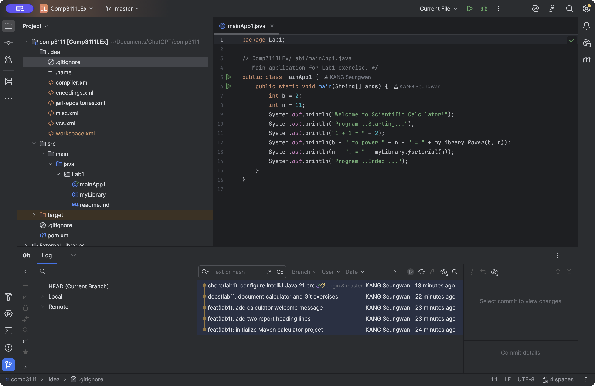

# COMP3111 Lab 1

This is my Lab 1 project for practising Git and GitHub. It uses Maven and Java 21 in IntelliJ IDEA.

`myLibrary.java` contains the power and factorial functions from the lab example. Running `mainApp1.java` calculates 2 to the power of 11 and 11 factorial, giving 2048 and 39916800.

The commits show the initial code, the added print statements, and the README updates.

## Screenshot

The screenshot below shows the project folders, Java code, and Git history in IntelliJ.

